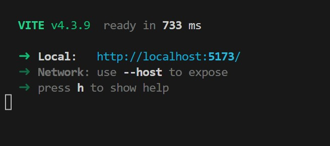

# Overview
This app is to demo rendering the barn model. Its colors are slightly different in Blender but you should have full control of the 3D canvas with your mouse. You can zoom and pan in any direction.

# Project Requirements
Node.js is require to run the project. If you don't have it download it [here](https://nodejs.org/en/download)

# Installing and Running the App
Clone the app
```bash
git clone https://github.com/michaelto20/BarnRenderer.git
```

On the command line, navigate into the `BarnRenderer` folder and run the following command to install the node dependencies
```bash
npm install
```

After that completes, to run the app use the command
```bash
npm run dev
```

If the command runs successfully, you should see a localhost url that is hosting the app.



